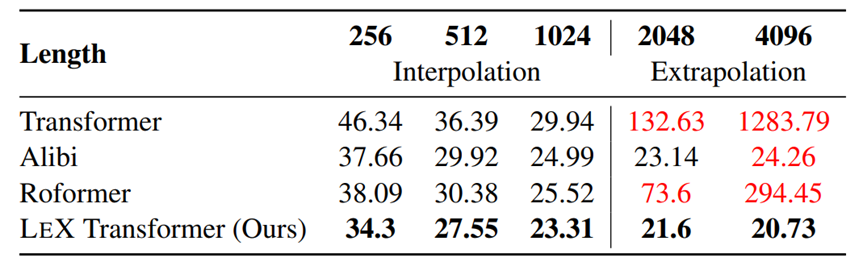
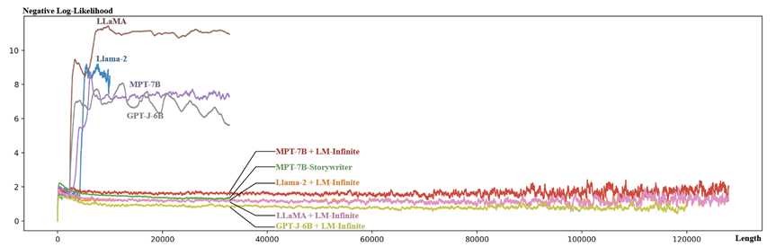

## 背景
### RoPE

#### 简介
>
> RoFormer: Enhanced transformer with Rotary Position Embedding

Transformer中在计算m位置token对n位置token注意力权重时，记
$$\begin{equation}
\begin{aligned}
q_m=f_q(x_m,m)\\k_n=f_k(x_n,n)\\v_n=f_v(x_n,n)
\end{aligned}
\end{equation}$$
则
$$\begin{equation}a_{m,n}=\frac{\exp(\frac{q_m^\intercal k_n}{\sqrt{d}})}{\sum_{j=1}^N\exp(\frac{q_m^\intercal k_j}{\sqrt{d}})}\end{equation}$$
为引入相对位置信息，即：
$$\begin{equation}
\langle f_q(x_m,m),f_k(x_n,n)\rangle=g(x_m,x_n,m-n)\end{equation}$$
$$其中x_m是序列里第m个位置的token的word\ embedding$$
二维情况下一个解是：
$$\begin{equation}
\begin{aligned}
f_q(\mathbf{x}_m,m)& =(W_qx_m)e^{im\theta} \\
f_k(x_n,n)& =(W_kx_n)e^{in\theta} \\
g(x_m,x_n,m-n)& =\mathrm{Re}[(W_qx_m)(W_kx_n)^*e^{i(m-n)\theta}]
\end{aligned}
\end{equation}$$
$$其中Re[・]代表复数的实部,()^*代表共轭复数,根据欧拉公式将f写成矩阵形式为:$$
$$\begin{equation}f_{\{q,k\}}(x_m,m)=\begin{pmatrix}\cos m\theta&-\sin m\theta\\\\\sin m\theta&\cos m\theta\end{pmatrix}\begin{pmatrix}W_{\{q,k\}}^{(11)}&W_{\{q,k\}}^{(12)}\\\\W_{\{q,k\}}^{(21)}&W_{\{q,k\}}^{(22)}\end{pmatrix}\begin{pmatrix}x_m^{(1)}\\\\x_m^{(2)}\end{pmatrix}\end{equation}$$
可以看作是将x进行了旋转变换
推导至任意d维时,将d维子空间分解为d/2,然后利用内积的线性性质进行组合:
$$\begin{equation}f_{\{q,k\}}(x_m,m)=R_{\Theta,m}^dW_{\{q,k\}}x_m\end{equation}$$
$$\begin{equation}\boldsymbol{R}_{\boldsymbol{\Theta},\boldsymbol{m}}^d=\begin{pmatrix}\cos m\theta_1&-\sin m\theta_1&0&0&\cdots&0&0\\\sin m\theta_1&\cos m\theta_1&0&0&\cdots&0&0\\0&0&\cos m\theta_2&-\sin m\theta_2&\cdots&0&0\\0&0&\sin m\theta_2&\cos m\theta_2&\cdots&0&0\\\vdots&\vdots&\vdots&\vdots&\ddots&\vdots&\vdots\\0&0&0&0&\cdots&\cos m\theta_{d/2}&-\sin m\theta_{d/2}\\0&0&0&0&\cdots&\sin m\theta_{d/2}&\cos m\theta_{d/2}\end{pmatrix}\end{equation}$$
如下图所示：

#### 问题
尽管 RoPE 可以理论上可以编码任意长度的绝对位置信息，并且通过三角计算将任意长度的相对位置信息呈现出来，RoPE 仍然存在外推问题（length extrapolation problem），即对于基于 RoPE 的大语言模型，测试长度超过训练长度之后，模型的效果会有显著的崩坏，具体表现为语言建模困惑度急剧攀升。
对此，已经有很多研究给出了不同的来源解释以及应对策略。这些应对策略的研究工作主要可以分为两个流派。流派一，限制注意力的工作，例如滑动窗口，以及各种滑窗的变体，软窗口、块窗口、平行窗口、箭形窗口 等；流派二，调整旋转角的工作，例如线性内插、NTK 方法、调整 base 续训等。
## 扩展上下文长度

### 限制注意力

#### ALiBi

> TRAIN SHORT, TEST LONG: ATTENTION WITH LINEAR BIASES ENABLES INPUT LENGTH EXTRAPOLATION

将滑动窗口与 T5 bias 结合，公式如下：
$$\begin{equation}A_{t,s}=\boldsymbol{x}_t\boldsymbol{W}_Q\boldsymbol{W}_K^T\boldsymbol{x}_s^T+b(s-t)\quad b=2^{-\frac{8}{m}}\end{equation} $$
通过让 attention score 加上一个线性偏置（每个注意力头不同）实现一个软词窗，让模型关注相对距离较近的，给予相对距离较远的惩罚。
效果：

#### xPos

> A Length-Extrapolatable Transformer

将滑动窗口和 RoPE 结合，公式如下：
$$\begin{equation}
\begin{aligned}
\boldsymbol{A}_{t,s}=\mathrm{Re}\left[\sum_{n=1}^{d/2}\zeta_n^te^{it\theta_n}\tilde{q}_t^{^{(n)}}\left(\zeta_n^{-s}e^{is\theta_n}\tilde{k}_s^{^{(n)}}\right)^*\right]=\sum_{n=1}^{d/2}\mathrm{Re}\left[\tilde{q}_t^{^{(n)}}{\tilde{k}_s^{^{(n)}}}^*\zeta_n^{t-s}e^{i(t-s)\theta_n}\right] \\
\zeta_n=\frac{2n/d+\gamma}{1+\gamma}, \gamma=0.4,\quad\theta_n=10000^{-2n/d}
\end{aligned}
\end{equation}$$
通过让 attention score 乘上一个指数衰减的系数（每个维度不同）实现远距离抑制。xPos 的可贵之处在于其提出的指数衰减系数是可拆分的。上述两个词窗变体 ALiBi 和 xPos 都应用于预训练阶段，与之相对，主流的词窗方法往往都应用于测试阶段，例如，在论文中，作者还提出了一个分块的词窗方法（Blockwise Causal Attention，BCA），超出训练长度$T_{train}$后，每个 token 至多能看到$T_{train}$个，至少能看到$T_{train}/2$个 token。应用 BCA，xPos 的效果会得到进一步提升，如图所示：

效果（困惑度）:

#### PCW

>Parallel Context Windows for Large Language Models

虽然限制感知范围是一个比较直觉可行的方案，但是对于上下文学习这样的学习范式，上文（包含若干例子以及任务提示）中的每个例子都是需要感知到的，由此就引出了另外一种词窗变体，平行词窗（Parallel Context Window）。PCW 最早提出平行词窗，PCW 让输入的提示跟每个例子之间都会有注意力计算，但是例子与例子之间并不做注意力计算，即整个 attention score 上会有一个如图所示的 mask:

#### LM-Infinite
> LM-Infinite: Zero-Shot Extreme Length Generalization for Large Language Models

1. 提出了影响长度泛化 OOD（out-of-distibution）的三个主要因素：unseen distance、unseen number of tokens in attention、implicity encoded positional information
1. 提出了解决长度泛化的方案：attention mask 和 distance ceiling

Attention mask:通过 Attention Mask 只关注最开始的 token 和最近的$L_{pretrain}$ token
Distance ceiling（存疑，没有消融实验）:在相对位置编码的模型中，将相对位置$d$限制为$d'=min(d,L_{pretrain})$

效果：

#### StreamingLLM
> EFFICIENT STREAMING LANGUAGE MODELS WITH ATTENTION SINKS

与 LM-Infinite 相似，主要区别为位置编码不是简单截断而是改为在选择的L_pretrain长度序列中的相对位置
效果：

Infini-attention
Leave No Context Behind: Efficient Infinite Context Transformers with Infini-attention
Infini-Transformer处理的是一系列片段

1.引入压缩内存：
$$\begin{equation}M_s\leftarrow M_{s-1}+\sigma(K)^TV\quad\mathrm{and}\quad z_s\leftarrow z_{s-1}+\sum_{t=1}^N\sigma(K_t)\end{equation}$$
其中，$M_s $是当前段的内存状态，$σ$ 是激活函数，$z_s$ 是用于归一化的项
2. 记忆检索：
$$\begin{equation}A_{\mathrm{mem}}=\frac{\sigma(Q)M_{s-1}}{\sigma(Q)z_{s-1}}\end{equation}$$通过查询向量$Q$来检索压缩内存$M_{s-1}$中的相关信息
3. 结合局部和全局注意力
$$\begin{equation}A=\mathrm{sigmoid}(\beta)\odot A_{\mathrm{mem}}+(1-\mathrm{sigmoid}(\beta))\odot A_{\mathrm{dot}}\end{equation}$$
其中，$A_{mem}$是从压缩内存中检索到的内容，$A_{dot}$是传统点积注意力的结果，$\beta$是一个学习得到的门控参数，用于调节长期记忆和局部注意力的权重

内存开销很小的情况下，困惑度也低

5k长度的微调可以完成1M长度的密钥检索任务

### 调整旋转角

从最早的三角式位置编码（Sinusoidal Position Embedding）到旋转位置编码 RoPE，关于$\theta_n$的取值几乎一直是 $\theta_n=10000^{−2n/d}$，目前调整旋转角成为在微调阶段改进 RoPE 外推能力的主流。
#### 线性内插(PI)
> EXTENDING CONTEXT WINDOW OF LARGE LANGUAGE MODELS VIA POSITION INTERPOLATION

$将RoPE中的f替换为f'$,直接进行位置的线性缩放

$$\begin{equation}\mathbf{f'}(\mathbf{x},m)=\mathbf{f}\left(\mathbf{x},\frac{mL_{train}}{L_{tune}}\right)\end{equation}$$
$$\begin{equation}\boldsymbol{A}_{t,s}=\mathrm{Re}\left[\sum_{n=0}^{d/2-1}\tilde{q}_t^{(n)}{\tilde{k}_s^{(n)}}^*e^{i\frac{(t-s)}\lambda\theta_n}\right]=\mathrm{Re}\left[\sum_{n=0}^{d/2-1}\tilde{q}_t^{(n)}{\tilde{k}_s^{(n)}}^*e^{i(t-s)\frac{\theta_n}\lambda}\right]\quad\lambda=\frac{L_{\mathrm{tune}}}{L_{\mathrm{train}}}\end{equation}$$
这个系数既可以理解为除在下标上，也可以理解为除在旋转角$\theta_n$上，通过一个常数让$\theta_n$缩小，意图去表征更长的上下文特征

#### Fixed NTK
> https://www.reddit.com/r/LocalLLaMA/comments/14lz7j5/ntkaware_scaled_rope_allows_llama_models_to_have/

$$\begin{equation}
\theta_n=(10000\cdot\alpha)^{-2n/d}\end{equation}$$
仅通过放大旋转角的底数，即实现让不同维度的$\theta_n$自适应缩小，大的$\theta_n$缩小幅度较小仍对应高频特征，小的$\theta_n$缩小幅度较大仍适配低频特征。

#### dynamic NTK
> https://www.reddit.com/r/LocalLLaMA/comments/14mrgpr/dynamically_scaled_rope_further_increases/

区别于上面固定的$\alpha$，动态放大base
$$\begin{equation}\alpha_t=\max\left(1,2^{\left[\log_2\frac{t}{T_{\mathrm{train}}}\right]+1}-1\right)\end{equation}$$
两种NTK方法由于其校正方式适配原始RoPE的$\theta_n$取值，无需续训即可以外推，目前已集成进Huggingface的LLaMA实现，并且在Qwen等模型外推中得到了应用；dynamic NTK就是Qwen的实现版本，其优点是不需要额外超参数。NTK方法深刻影响了后续的RoPE外推研究，例如Code LLaMA直接把base设为1000000，然后在16K长代码上续训实现128K外推，再例如LLaMA2 Long，也是直接把base设成500000，然后在16K长上续训实现32K外推。
#### 缩放法则
> Scaling Laws of RoPE-based Extrapolation

以上方法都是通过缩小$\theta_n$实现外推，但在这篇论文中作者发现放大$\theta_n$也可以实现外推（续训长度与原始训练长度一致）

